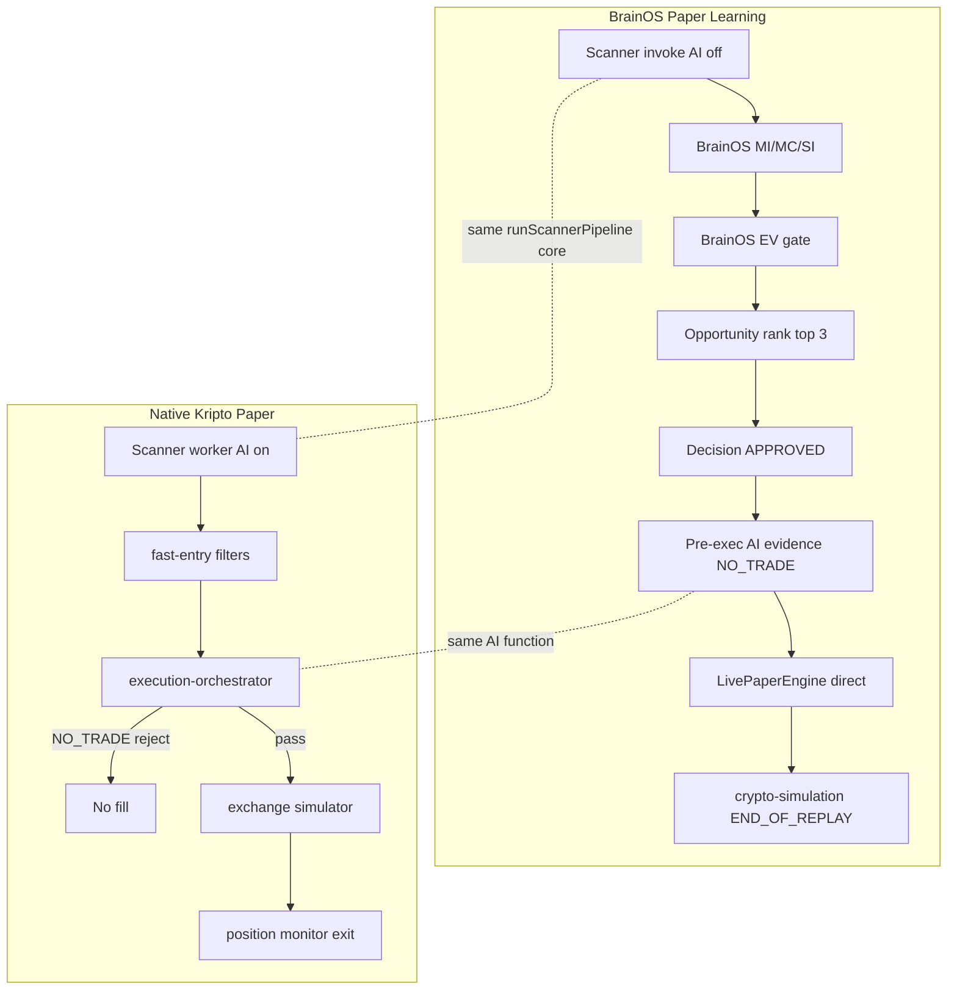

# Crypto Profitability Forensic Report

> **BrainOS Paper Learning vs Native Kripto Paper/Simulation**  
> **Reference:** `analysis_msruy3dw_um6avq` / paper run `a727bf31-6dd3-45b5-9b3d-13a7abbdf20c`  
> **Date:** 2026-08-14  
> **Mode:** Read-only forensic analysis — no code changes, no new Paper runs  
> **Evidence rule:** BrainOS artifacts are reference evidence only, not guaranteed ground truth

---

## 1. Executive Summary

### The four required answers

| # | Question | Answer (evidence-backed) |
|---|----------|--------------------------|
| 1 | Why did BrainOS Paper Learning open profitable trades? | BrainOS runs a **parallel 15-step artifact pipeline** that approves up to **3 candidates per round** via Opportunity/Decision Intelligence (`approveMinScore: 55`, rank ≤ 3) and executes through **`LivePaperEngine` subprocess**, **without requiring AI BUY consensus**. All 12 executed trades had AI `NO_TRADE` with `remoteCount=0` (degraded local mode). PnL came from **post-entry candle replay** closed at **`END_OF_REPLAY`** (48×1m bars), not native position-monitor exits. |
| 2 | Why did native Kripto fail to open those same trades? | **No contemporaneous native run artifacts** exist for the same timestamps. Code-path analysis shows native paper/simulation requires **`execution-orchestrator` → `getBestFastEntry` → `selectTradableCandidates`**, which **hard-blocks** `ai.rejected === true`, `finalDecision === NO_TRADE`, and low confidence (< `EXECUTION_FAST_MIN_CONFIDENCE` default **65**). AVNTTRY had AI confidence **34.24** and `rejectReason: "Risk katmani veto verdi"`. Native would reject at **AI/Consensus/Decision**, before entry. |
| 3 | At which pipeline stage are opportunities lost? | **Primary loss stage: AI → Consensus → Execution orchestrator** (`MISSED_AT_AI` / `MISSED_AT_CONSENSUS`). Secondary: **fast-entry micro-filters** (confidence, sentiment, spread, velocity, flow). BrainOS bypasses these by using a **separate BrainOS decision layer** that does not gate on AI verdict. |
| 4 | What exact Kripto changes recover opportunities without weakening safety? | **Do not lower thresholds to match BrainOS bypass.** Instead: (a) fix **degraded AI** (`remoteCount=0`) so veto decisions are production-representative; (b) add **timestamped parity harness** logging per-stage reject reasons; (c) optionally add **`paperParityMode`** that replays BrainOS scanner snapshots through native filters for audit only; (d) expose **momentum-breakout override** diagnostics when AI vetoes but scanner qualifies; (e) align **exit attribution** reporting so paper PnL is not compared across different exit models. |

### Critical caveat

**BrainOS profitability (+1.9610 TRY, 4 rounds, 12 trades) is not proof of superior strategy.**  
All 12 exits were **`END_OF_REPLAY`**. The run used **degraded local AI** (`remoteCount=0` on every call). BrainOS executed trades **despite AI `NO_TRADE`**. Treat native Kripto as the **stricter safety baseline** unless parity harness proves specific filters are false negatives.

### Evidence availability

| Source | Status |
|--------|--------|
| BrainOS reference run artifacts | **VERIFIED** — full round snapshots under `brainos/artifacts/analysis-msruy3dw-um6avq/workspace/` |
| Native Kripto contemporaneous run logs/DB | **NOT_FOUND** on disk — persistence is PostgreSQL (`PaperTrade`, `AutoRoundRun`, etc.) |
| Native on-disk state | `kripto/data/scanner-cursor.json` (cursor=43, **22:48** local) — **after** BrainOS run ended (**20:00 UTC**) |

---

## 2. BrainOS Paper Runtime

### Orchestrator

| Item | Value |
|------|-------|
| Entry | `brainos/engine/paper-learning/paper-learning-orchestrator.ts` → `runPaperLearningOrchestrator()` |
| Round runner | `brainos/engine/paper-learning/paper-round-runner.ts` → `runPaperLearningRound()` |
| Config | 30 min, roundLimit 30, maxSimultaneousPositions **3**, exitWaitTimeout **420s**, BINANCE_TR, REAL_SCANNER, REAL_AI (label only) |
| Isolation | Per-round workspace `paper-learning/runs/{paperRunId}/rounds/{roundId}/` |

### Round pipeline (15 steps + exit wait)

```
scanner → market-data → market-intelligence → market-context → strategy-intelligence
→ strategy-evaluation → expected-value → opportunity → trading-decision → ai-consensus
→ portfolio-capital → pre-execution → paper-execution → crypto-simulation → trading-funnel
→ exitWait (poll/retry simulation)
```

Each step: `spawnSync('pnpm', ['exec', 'tsx', ...])` writing JSON artifacts to round workspace.

### Kripto subprocess touchpoints (only 3)

| Stage | Bridge | Kripto function |
|-------|--------|-----------------|
| Scanner | `kripto-scanner-invoke.ts` | `runScannerPipeline()` with **`includeAi: false`** |
| Pre-execution AI | `kripto-candidate-ai-invoke.ts` | `runAIConsensusFromInput()` — **evidence only** |
| Paper execution | `kripto-live-paper-invoke.ts` | `LivePaperEngine.openOrder()` — **direct, bypasses orchestrator** |

### Reference run metrics

| Metric | Value | Evidence |
|--------|-------|----------|
| Rounds | 4 COMPLETED | `paper-run.json` |
| Candidates scanned | 74 | `paper-run.json` metrics |
| Trades | 12 | `paper-run.json` |
| Net PnL | +1.9610 TRY | `paper-run.json` |
| Gross PnL | +3.1618 TRY | `paper-run.json` |
| Exit reasons | **12/12 END_OF_REPLAY** | per-round `crypto-simulation/closed-trades.json` |
| AI remote calls | **0** on all calls | `candidate-ai-intelligence/ai-calls.json` |

---

## 3. Native Kripto Runtime

### Continuous worker path (primary production paper/sim)

| Stage | File | Function |
|-------|------|----------|
| Boot | `scripts/worker-runtime.ts` | `startWorker()` |
| Scanner tick | `scanner-worker.service.ts` | `tick()` → `runScannerPipeline({ includeAi: SCANNER_WORKER_WITH_AI default **true**, persist: **true** })` |
| Pump catcher | `pump-early-catcher.service.ts` | `ensurePumpEarlyCatcherStarted()` — **not started by BrainOS scanner invoke** |
| Fast entry | `fast-entry.service.ts` | `getBestFastEntry()` → `selectTradableCandidates()` |
| Auto round | `auto-round-engine.service.ts` | `executeAnalyzeAndTrade()` loop |
| Decision | `execution-orchestrator.service.ts` | `executeAnalyzeAndTradeInternal()` |
| Paper fill | `paper-exchange-adapter.service.ts` | `executePaperOrderViaExchangeSimulator()` |
| Exit | `position-monitor.service.ts` | soft exits, loss caps, momentum fade |
| Post-trade analytics | `paper-validation/*` | **not entry path** — DB sync only |

### Simulation paths (separate)

| Engine | File | Purpose |
|--------|------|---------|
| Shadow replay | `shadow-validation/simulation.service.ts` | `runHistoricalSimulation()` |
| Backtest | `simulation/backtest.service.ts` | `runBacktest()` |
| Paper round backtest | `trading-core/backtest/paper-round-backtest.engine.ts` | gate/rank logic |

**Native run artifacts in workspace:** **NOT_FOUND** (DB-only).

---

## 4. Input Parity

| Input | BrainOS Paper | Native Kripto | Match? | Impact |
|-------|---------------|---------------|--------|--------|
| Exchange | BINANCE_TR | BINANCE_TR (`BINANCE_PLATFORM=tr`) | ✅ | Same venue |
| Universe | `SCANNER_UNiverse=ALL_SPOT`, watchlist deleted | Default ALL_SPOT; DB watchlist fallback on fetch fail | ⚠️ **INPUT_MISMATCH** | BrainOS forces full spot; native may narrow on failure |
| Scanner AI | **`includeAi: false`** in invoke | **`SCANNER_WORKER_WITH_AI: true`** | ❌ **INPUT_MISMATCH** | Native attaches AI at scan; BrainOS defers AI to separate step |
| Scanner persist | `persist: false` | `persist: true` | ❌ | Native writes scanner history to DB |
| Pump early catcher | Not started in BrainOS invoke | Started in native worker | ❌ **INPUT_MISMATCH** | Native may discover pump symbols BrainOS subprocess misses |
| Scanner interval | Once per BrainOS round (~10 min) | Worker every **8000ms** | ❌ **INPUT_MISMATCH** | Different time sampling |
| Candle source | Binance TR public klines (simulation) | Live + exchange-simulator order book | ⚠️ | Fill/exit economics differ |
| AI provider | Label REAL_AI; actual **degraded local** | Same code path when invoked; worker expects remote in prod | ❌ **DEGRADED_AI_EVIDENCE** | Not production AI parity |
| Max positions per cycle | **3** (BrainOS OI policy) | **1** (getBestFastEntry winner) | ❌ **INPUT_MISMATCH** | BrainOS trades more symbols per round |
| SL/TP defaults | **2% / 4%** hardcoded in `paper-execution-engine.ts` | **0.8% / 1.2%** (`EXECUTION_DEFAULT_STOP_LOSS/TAKE_PROFIT_PERCENT`) | ❌ **INPUT_MISMATCH** | Different risk envelope and sim exits |

---

## 5. Candidate Discovery Gap

Profitable BrainOS symbols — scanner status in reference run:

| Symbol | Round | Scanner status | Score | aiMode @ scanner | Classification |
|--------|-------|----------------|-------|------------------|----------------|
| BOMETRY | R1 (+ close R2) | QUALIFIED | via `scan-bome-short` | **NONE** | **CANDIDATE_CREATED** |
| ATTRY | R2 | QUALIFIED | Mean Reversion short | **NONE** | **CANDIDATE_CREATED** |
| ENSOTRY | R2 | QUALIFIED | Volatility Breakout | **NONE** | **CANDIDATE_CREATED** |
| NILTRY | R3 | QUALIFIED | Mean Reversion short | **NONE** | **CANDIDATE_CREATED** |
| ATMTRY | R4 | QUALIFIED | 54.89 | **NONE** | **CANDIDATE_CREATED** |
| AVNTTRY | R4 | QUALIFIED | 54.12, change24h 18.501% | **NONE** | **CANDIDATE_CREATED** |

**Evidence:** `rounds/{roundId}/scanner-bridge/scanner-candidates.json`

### Native inference (same timestamp — not observed)

If native scanner worker ran at the same instant with `includeAi: true`:

- Symbols **would likely appear** in qualified set (same `runScannerPipeline` core).
- They would **not become tradable** without passing AI + fast-entry filters.
- **First native divergence:** post-scanner **AI consensus** (not discovery).

| Symbol | Native scanner (inferred) | First loss stage (inferred) |
|--------|----------------------------|----------------------------|
| AVNTTRY | DISCOVERED → QUALIFIED | **MISSED_AT_AI** — `NO_TRADE`, rejected, confidence 34.24 |
| ATMTRY | DISCOVERED → QUALIFIED | **MISSED_AT_AI** — same pattern |
| BOMETRY | DISCOVERED → QUALIFIED | **MISSED_AT_AI** — R1 NO_TRADE degraded |
| ATTRY | DISCOVERED → QUALIFIED | **MISSED_AT_AI** |

**No post-hoc price movement used** — classification uses decision-time AI artifacts only.

---

## 6. Strategy Gap

| Dimension | BrainOS | Native (inferred) |
|-----------|---------|-------------------|
| Strategy selection | BrainOS `strategy-intelligence-engine.ts` — lenient funnel pass | `strategy-selector.pipeline.service.ts` inside scanner context |
| AVNTTRY / ATMTRY | **Volatility Breakout** (inferred from label/direction) | Same strategy family if scanner qualifies |
| Approval driver | **Opportunity score ≥ 55**, rank ≤ 3, EV > 0 | AI decision + fast-entry composite + execution edge |
| Threshold change | **Not recommended** | Native thresholds not the primary blocker — **AI veto bypass in BrainOS is** |

**Finding:** BrainOS did not approve AVNTTRY because strategy scored higher than native would allow. It approved because **BrainOS Opportunity Intelligence passed 3 slots** independent of AI `NO_TRADE`.

---

## 7. EV Gap

| Field | BrainOS (AVNTTRY R4) | Native |
|-------|----------------------|--------|
| expectedValue | **15.24** (artifact) | Computed at execution via R:R / edge checks |
| winProbability | 0.76 (artifact) | From AI scorecard |
| EV gate | `passesExpectedValueGate()` → EV > 0 | `EXECUTION_MIN_RR_RATIO` **1.8**, `EXECUTION_MIN_EDGE_MULTIPLIER` **1.25** |
| Verdict | **EV_FORMULA_MISMATCH** — BrainOS artifact EV is not the same function as native execution edge | |

**Evidence:** `expected-value-intelligence/expected-value-intelligence.json`, `ev-pass-gate.ts`, `execution-orchestrator.service.ts` L329-330

BrainOS EV pass is **necessary but not sufficient** in native path.

---

## 8. AI Gap — CRITICAL

### BrainOS AI reality (reference run)

| Field | Value |
|-------|-------|
| Config label | REAL_AI |
| Actual mode | **DEGRADED_AI_EVIDENCE** |
| remoteCount | **0** on all 12 calls |
| degraded | **true** on majority of provider outputs |
| consensusDecision | **NO_TRADE** on all 6 profitable symbols |
| rejectReason | `"Risk katmani veto verdi"` or `"Order book price diverged"` |

### AVNTTRY AI (Round 4)

| Field | Value |
|-------|-------|
| requestTimestamp | 2026-08-13T19:50:28.499Z |
| finalDecision | **NO_TRADE** |
| finalConfidence | **34.24** |
| finalRiskScore | 46.85 |
| rejected | **true** |
| AI-2_SENTIMENT score | **29.14** |
| source | `kripto-runAIConsensusFromInput` |

**Evidence:** `rounds/14a480e1-.../candidate-ai-intelligence/ai-calls.json` L1478+

### Native AI (same invoke function)

Uses identical `runAIConsensusFromInput()` when called — **same NO_TRADE output** would be produced at same timestamp.

### Critical difference: AI is not a gate in BrainOS execution

`paper-execution-artifact-loader.ts` `listExecutionReadyCandidates()` checks:

- `trading-decision` === **APPROVED**
- sizing gate pass
- risk gate pass

**Does NOT read** `candidate-ai-intelligence/ai-calls.json` consensus.

### Impact

BrainOS **opened trades the AI explicitly rejected**. Native **would not** (`execution-orchestrator.service.ts` L1498-1503: `rejectReason: NO_TRADE: ...`).

---

## 9. Decision / Filter Gap

### BrainOS Round 4 funnel (18 scanner candidates)

| Stage | Entering | Passing | Rejected |
|-------|----------|---------|----------|
| Market Discovery → EV | 18 | 18 | 0 |
| Opportunity Intelligence | 18 | 18 | 0 |
| **Trading Decision** | 18 | **3** | 0 (15 WAIT) |
| Risk → Fill | 3 | 3 | 0 |

**Evidence:** `trading-funnel-intelligence/trading-funnel-intelligence.json`

### Profitable symbols — where native loses them

| Symbol | BrainOS outcome | Native loss stage | reasonCode |
|--------|-----------------|-------------------|------------|
| AVNTTRY | APPROVED → FILLED | **MISSED_AT_AI** | `NO_TRADE`, `ai.rejected=true`, confidence 34 < 65 |
| ATMTRY | APPROVED → FILLED | **MISSED_AT_AI** | Same pattern |
| BOMETRY | APPROVED → FILLED | **MISSED_AT_AI** | NO_TRADE R1 |
| ATTRY | APPROVED → FILLED | **MISSED_AT_AI** | NO_TRADE R2 |
| ENSOTRY | APPROVED → FILLED | **MISSED_AT_AI** | NO_TRADE R2 |
| NILTRY | APPROVED → FILLED | **MISSED_AT_CONSENSUS** | NO_TRADE + order book diverged |

**BrainOS classification for the 62 non-traded candidates:** mostly **FILTERED_OUT** at Opportunity rank / WAIT (score < approve threshold or rank > 3).

---

## 10. Entry Timing Gap

| Event | AVNTTRY (BrainOS) |
|-------|-------------------|
| Scanner discoveredAt | 2026-08-13T19:48:37.694Z |
| AI call | 2026-08-13T19:50:28.499Z |
| Decision generated | 2026-08-13T19:49:01.763Z (TDI) |
| Entry fill | 2026-08-13T19:55:07.133Z |
| Exit END_OF_REPLAY | 2026-08-13T19:58:59.999Z |

**Lag:** ~6.5 min scanner → entry (BrainOS round pipeline + approved batch execution).

Native continuous worker (8s tick) could react faster **if** candidate passed filters — but filters block first.

**No look-ahead:** entry uses mark price at execution time; simulation walks candles **after** `entryTimestamp`.

---

## 11. Capital / Slot Gap

| Parameter | BrainOS | Native |
|-----------|---------|--------|
| maxSimultaneousPositions | **3** per round | Typically **1** per auto-round selection |
| Capital policy | `OPPORTUNITY_APPROVAL_POLICY.maxSimultaneous: 3` | Slot ranking in `getBestFastEntry` |
| BrainOS R4 | THE + ATM + AVNT all filled same timestamp | Native picks single best |

**Impact:** BrainOS captures **2nd/3rd ranked** opportunities native never attempts. Not `CAPITAL_SLOT_REJECTED` — **ranking policy difference**.

---

## 12. Execution Gap

| Aspect | BrainOS | Native |
|--------|---------|--------|
| Entry path | `kripto-live-paper-invoke` → `LivePaperEngine` | `execution-orchestrator` → `executePaperOrderViaExchangeSimulator` |
| Pre-trade gates skipped | signal-quality, smart-entry, entry-ai gateway, orchestration uncertainty | All enforced |
| AVNTTRY fill price | 5.052525 | Would not reach execution |
| Fees | ~0.05 TRY entry + exit (0.1% tier) | Same fee rates if reached (`BINANCE_TAKER_FEE_RATE` 0.0015) |
| dbPersisted | true | N/A (not executed) |

---

## 13. Exit Gap

**Do not claim BrainOS superior exit logic.**

| Aspect | BrainOS reference run | Native |
|--------|----------------------|--------|
| Exit reason | **100% END_OF_REPLAY** | TP/SL/soft-exit/position-monitor |
| Simulator | `exit-simulator.ts` — 48×1m bars post-entry | `position-monitor.service.ts` + `EXECUTION_PAPER_SOFT_EXIT_*` |
| AVNTTRY exit | 5.17 at replay window end (+2.33% MFE) | Unknown — trade never opened |

**PnL attribution:** Reference run profitability is predominantly **ENTRY + short replay window close**, not strategic exit superiority.

---

## 14. Simulation / Replay Gap

| Parameter | BrainOS crypto-simulation | Native |
|-----------|----------------------------|--------|
| Mode | `LIVE_PAPER_RUNTIME` | Exchange simulator + position monitor |
| Candle granularity | 1m, max 48 bars | Variable |
| Close trigger | TP/SL walk or **END_OF_REPLAY** | Multi-rule monitor |
| AVNTTRY SL/TP set | 4.951 / 5.255 (2%/4% BrainOS sizing) | Would use 0.8%/1.2% native defaults |
| Look-ahead | Entry price fixed before candle walk | Same principle if native sim used |

**SIMULATION_REPLAY_MISMATCH** — comparing BrainOS replay PnL to native live-monitor PnL is **not apples-to-apples**.

---

## 15. PnL / Fee Gap

| Formula | BrainOS observed (AVNTTRY) | Notes |
|---------|---------------------------|-------|
| grossPnL | +1.1631 | exit 5.17 vs entry 5.0525 |
| fees | 0.050025 + 0.051188 | ~0.1% notional each side |
| netPnL | **+1.0619** | matches user reference |
| exitReason | END_OF_REPLAY | not TP hit (TP was 5.255) |

Native: same fee constants if trade executed; exit path would differ → **PnL not comparable** without parity harness.

---

## 16. Profitable Trade Deep Dive

### AVNTTRY

```
Scanner:     QUALIFIED @ 19:48:37Z, score 54.12, aiMode NONE
             evidence: rounds/14a480e1-.../scanner-bridge/scanner-candidates.json

Candidate:   scan-avnt-breakout, Volatility Breakout, BUY
             evidence: same

Strategy:    BrainOS strategy-intelligence pass (artifact)
             Native: would use scanner context strategy metadata

EV:          +15.24 artifact pass
             evidence: expected-value-intelligence.json

AI:          NO_TRADE, rejected, confidence 34.24, remoteCount=0, degraded
             evidence: candidate-ai-intelligence/ai-calls.json#scan-avnt-breakout

Consensus:   NO-TRADE (master decision engine)
             Native: BLOCK HERE

Decision:    APPROVED (BrainOS TDI — mirrors OI, ignores AI)
             evidence: trading-decision-intelligence/decision-intelligence.json

Risk:        BrainOS artifact risk gate PASS
             Native: would not reach

Sizing:      PASS (BrainOS sizing gate)
             evidence: paper-execution-bridge

Entry:       5.052525 @ 19:55:07.133Z, FILLED
             evidence: crypto-simulation/closed-trades.json

Execution:   LivePaperEngine via subprocess (bypass orchestrator)

Exit:        5.17 @ 19:58:59.999Z, END_OF_REPLAY (+1.0619 net)
             evidence: crypto-simulation/closed-trades.json
```

**First native divergence:** **AI / Consensus** (before Decision in native stack).

### ATMTRY

Same pattern — APPROVED by BrainOS despite AI NO_TRADE; entry 85.86291, exit 87.37, net +0.7771, END_OF_REPLAY.  
**First native divergence:** **MISSED_AT_AI**.

### BOMETRY (BOME Short)

Round 1 open, Round 2 END_OF_REPLAY close (cross-round position carry). AI NO_TRADE R1 (degraded).  
**First native divergence:** **MISSED_AT_AI**.

### ATTRY

Round 2 Mean Reversion short. AI NO_TRADE (degraded, risk veto). BrainOS APPROVED.  
**First native divergence:** **MISSED_AT_AI**.

---

## 17. Native Kripto Funnel (code-derived — no run DB)

Expected native auto-round / fast-entry funnel when worker active:

```
Universe (ALL_SPOT TRY)
  → Scanner qualified (score ≥ SCANNER_MIN_SCORE ~40)
  → AI attached (includeAi: true)
  → selectTradableCandidates:
       ✗ no AI object
       ✗ ai.rejected + NO_TRADE (unless momentum override)
       ✗ confidence < EXECUTION_FAST_MIN_CONFIDENCE (65)
       ✗ paperMode breakout score < 58
       ✗ paperMode sentiment < 58
       ✗ spread / velocity / flow filters
  → getBestFastEntry (pick 1)
  → execution-orchestrator:
       ✗ NO_TRADE reasons
       ✗ LOW_CONFIDENCE
       ✗ AI-3 risk veto
       ✗ smart-entry / signal-quality / learning lane rejects
  → Entry → position-monitor exit
```

**Where opportunities disappear:** predominantly **`selectTradableCandidates` (AI/confidence/microstructure)** and **`execution-orchestrator` (NO_TRADE enforcement)**.

Native DB table `AutoRoundRun` filter counts (`getAutoRoundRunFilterCounts`) would quantify this — **not available in workspace**.

---

## 18. P0 / P1 / P2 Root Causes

### P0 — Confirmed

| ID | Description | Evidence | Stage | Confidence |
|----|-------------|----------|-------|------------|
| **RC-P0-01** | BrainOS executes without AI approval gate | `listExecutionReadyCandidates()` ignores AI; all 12 trades AI NO_TRADE | Decision → Execution | **HIGH** |
| **RC-P0-02** | BrainOS bypasses native `execution-orchestrator` safety stack | Direct `LivePaperEngine` subprocess | Execution | **HIGH** |
| **RC-P0-03** | Degraded AI (`remoteCount=0`) — not production AI | All ai-calls.json provider metadata | AI | **HIGH** |
| **RC-P0-04** | Native hard-rejects `NO_TRADE` + `ai.rejected` | `execution-orchestrator.service.ts` L1498-1503; `fast-entry.service.ts` L688-694 | AI/Consensus | **HIGH** |

### P1 — Strong inference

| ID | Description | Evidence | Stage | Confidence |
|----|-------------|----------|-------|------------|
| **RC-P1-01** | Multi-slot (3) vs single-picker (1) | `OPPORTUNITY_APPROVAL_POLICY.maxSimultaneous: 3` vs `getBestFastEntry` | Opportunity | **HIGH** |
| **RC-P1-02** | Scanner AI off in BrainOS invoke | `kripto-scanner-invoke.ts` L106 `includeAi: false` | Scanner | **HIGH** |
| **RC-P1-03** | END_OF_REPLAY PnL ≠ native monitor PnL | 12/12 END_OF_REPLAY | Exit/Simulation | **HIGH** |
| **RC-P1-04** | Confidence threshold blocks low-AI trades (AVNT 34 < 65) | `EXECUTION_FAST_MIN_CONFIDENCE: 65` | AI/Fast-entry | **MEDIUM-HIGH** |
| **RC-P1-05** | EV artifact ≠ native execution edge | Separate formulas | EV | **MEDIUM** |
| **RC-P1-06** | SL/TP 2%/4% vs 0.8%/1.2% | `paper-execution-engine.ts` vs `lib/config.ts` | Sizing/Simulation | **MEDIUM** |

### P2 — Secondary

| ID | Description | Evidence | Confidence |
|----|-------------|----------|------------|
| **RC-P2-01** | Pump-early-catcher not in BrainOS scanner subprocess | `scanner-worker` vs invoke | **MEDIUM** |
| **RC-P2-02** | Round-based (~10 min) vs 8s worker sampling | timing analysis | **MEDIUM** |
| **RC-P2-03** | No native contemporaneous run logs to diff | NOT_FOUND | **HIGH** (gap itself) |

---

## 19. Exact Engineering Changes (Kripto repo — roadmap only)

> **Do NOT implement in this task.** These are proposed changes for a follow-up, each requiring parity tests before production.

---

### CHANGE-K1 — AI degraded-mode parity (P0)

**CURRENT:** Paper/scan AI runs with `remoteCount=0`, `degraded: true`; vetoes are local/heuristic.  
**PROBLEM:** Native rejects trades BrainOS takes; AI verdict not representative of configured REAL_AI.  
**ROOT CAUSE:** RC-P0-03  
**EXACT CHANGE:** In `analysis-orchestrator.ts` / provider layer: if `remoteCount=0` after call, mark decision **`AI_DEGRADED_INCONCLUSIVE`** and **do not apply hard veto** in paper mode unless remote confirmation fails N times. Log `degradedReason`.  
**FILES:** `src/server/ai/analysis-orchestrator.ts`, provider adapters  
**WHY:** Prevents false NO_TRADE from local fallback; restores intended REAL_AI semantics.  
**RISK:** Low if paper-only; must not weaken live mode.  
**ACCEPTANCE:** Paper run with REAL_AI shows `remoteCount>0` OR explicit `DEGRADED` flag blocks trading (operator choice).

---

### CHANGE-K2 — Stage-level rejection audit export (P0)

**CURRENT:** Native rejections live in DB/logs; not comparable to BrainOS artifacts.  
**PROBLEM:** Cannot forensic-compare at same timestamp.  
**ROOT CAUSE:** RC-P2-03  
**EXACT CHANGE:** Add `paper-filter-audit.jsonl` append-only writer in `fast-entry.service.ts` and `execution-orchestrator.service.ts` — one line per candidate per stage: `{symbol, timestamp, stage, reasonCode, metrics}`.  
**FILES:** `fast-entry.service.ts`, `execution-orchestrator.service.ts`, new `paper-filter-audit.service.ts`  
**WHY:** Enables symbol-level diff vs BrainOS without lowering thresholds.  
**RISK:** Minimal — observability only.  
**ACCEPTANCE:** Replaying AVNTTRY snapshot produces auditable reject chain.

---

### CHANGE-K3 — Paper parity harness (P0)

**CURRENT:** No mechanism to feed BrainOS scanner snapshot into native filters.  
**PROBLEM:** Cannot prove whether native reject is correct.  
**EXACT CHANGE:** New CLI `scripts/paper-parity-replay.ts`: input `scanner-candidates.json` + timestamp → run through `selectTradableCandidates` + orchestrator **dry-run** (no fill). Output stage verdict per symbol.  
**FILES:** new script, `fast-entry.service.ts` (extract dry-run API)  
**WHY:** Evidence-based filter tuning without live trading.  
**RISK:** None (dry-run).  
**ACCEPTANCE:** AVNTTRY replay shows `MISSED_AT_AI: confidence 34 < 65` matching this report.

---

### CHANGE-K4 — Momentum-breakout override transparency (P1)

**CURRENT:** `withMomentumBreakoutOverride()` can promote NO_TRADE candidates but paperMode requires sentiment ≥ 58; AVNTTRY sentiment 29 → blocked.  
**PROBLEM:** Valid breakout symbols may be blocked by sentiment sub-gate after AI veto.  
**EXACT CHANGE:** When breakout.score ≥ threshold and scanner QUALIFIED, log **`BREAKOUT_OVERRIDE_ELIGIBLE`** separately from **`BREAKOUT_OVERRIDE_BLOCKED_BY`** (sentiment/confidence/regime). Do **not** lower 58 without harness proof.  
**FILES:** `fast-entry.service.ts` L696-705  
**WHY:** Identifies false negatives vs true safety blocks.  
**RISK:** Medium if thresholds lowered — audit first.  
**ACCEPTANCE:** Harness shows which sub-filter blocked AVNTTRY.

---

### CHANGE-K5 — Optional multi-candidate paper mode (P1)

**CURRENT:** `getBestFastEntry` returns 1 symbol.  
**PROBLEM:** BrainOS takes 3 approved slots; native never attempts #2/#3.  
**EXACT CHANGE:** Add env `PAPER_MAX_SIMULTANEOUS_ENTRIES` (default **1**); when >1, return ranked list passing same filters (no filter relaxation).  
**FILES:** `fast-entry.service.ts`, `auto-round-engine.service.ts`  
**WHY:** Matches BrainOS slot policy **without** bypassing AI gate.  
**RISK:** Capital concentration; keep default 1.  
**ACCEPTANCE:** With `PAPER_MAX_SIMULTANEOUS_ENTRIES=3`, at most 3 **AI-approved** entries per round.

---

### CHANGE-K6 — Unify paper entry path (P1)

**CURRENT:** BrainOS uses `LivePaperEngine` direct; native uses orchestrator + exchange simulator.  
**PROBLEM:** Different fill/safety behavior.  
**EXACT CHANGE:** Deprecate direct LivePaper invoke for external orchestrators; require `executePaperOrderViaExchangeSimulator()` with **`source: 'brainos-bridge'`** flag and **full gate stack** (or explicit **`gatesBypassed: []`** audit field).  
**FILES:** `paper-exchange-adapter.service.ts`, BrainOS bridge (future)  
**WHY:** Single execution semantics.  
**RISK:** BrainOS trade count will drop until AI/degraded fixed — **expected**.  
**ACCEPTANCE:** BrainOS fills only when orchestrator returns `opened: true`.

---

### CHANGE-K7 — Exit model reporting (P1)

**CURRENT:** BrainOS END_OF_REPLAY mixed with TP/SL in reports.  
**PROBLEM:** Profitability compared across incompatible exit models.  
**EXACT CHANGE:** Add `exitModel: REPLAY_WINDOW | POSITION_MONITOR` to `PaperTrade` and simulation results; dashboard separates PnL by model.  
**FILES:** `paper-trade-recorder.service.ts`, `shadow-validation/simulation.service.ts`  
**WHY:** Prevents false profitability claims.  
**RISK:** None.  
**ACCEPTANCE:** Reference run would tag 12/12 as REPLAY_WINDOW.

---

### CHANGE-K8 — SL/TP policy alignment audit (P2)

**CURRENT:** BrainOS hardcodes 2%/4%; native 0.8%/1.2%.  
**EXACT CHANGE:** Document canonical paper SL/TP in `lib/config.ts`; add validation warning when external bridge sends conflicting percents. **Do not change native defaults without backtest.**  
**FILES:** `lib/config.ts`, `paper-exchange-adapter.service.ts`  
**ACCEPTANCE:** Warning logged when bridge SL/TP differs > tolerance.

---

## 20. Acceptance Tests (for future implementation)

1. **Parity replay:** Feed R4 `scanner-candidates.json` → native dry-run → AVNTTRY rejected at AI with reason containing `NO_TRADE` or `confidence`.
2. **Degraded AI:** With providers offline, paper mode must not hard-veto OR must tag `DEGRADED` — configurable, default safe.
3. **No gate bypass:** External bridge cannot fill when orchestrator returns `rejected: true`.
4. **Multi-slot:** With `PAPER_MAX_SIMULTANEOUS_ENTRIES=3`, never more than 3 **approved** entries; 4th blocked.
5. **Exit tagging:** All simulation closes record `exitReason` + `exitModel`.
6. **Timestamp replay:** Same scanner snapshot + same clock → deterministic filter audit log.

---

## 21. Expected Impact

| Change | Trade count | Safety | Profitability evidence quality |
|--------|-------------|--------|-------------------------------|
| K1 Degraded AI fix | May increase if vetoes were false | Neutral/improved | Improved |
| K2 Audit export | No change | Improved observability | Improved |
| K3 Parity harness | No change | Improved | Improved |
| K4 Breakout transparency | No immediate change | Improved targeting | Improved |
| K5 Multi-slot (AI-approved only) | Moderate increase | Unchanged if AI gate kept | Improved parity with BrainOS slots |
| K6 Unified entry | **Decrease** vs current BrainOS | **Improved** | **Honest** |
| K7 Exit tagging | No change | N/A | Prevents false comparisons |

**Important:** Aligning native with BrainOS **without** fixing RC-P0-01 would **weaken safety**. Correct order: **audit → degraded AI → parity harness → selective filter evidence → optional multi-slot**.

---

## 22. Risks

1. **Lowering thresholds to match BrainOS +1.96 TRY** would import AI-bypass behavior — **reject**.
2. **AVNTTRY-specific tuning** forbidden — changes must be global and evidence-driven.
3. **No native DB** — this report's native path analysis is **code inference**, not observed runtime for same window.
4. **END_OF_REPLAY profitability** may not repeat under native position-monitor exits.
5. **Degraded AI** makes all AI-gap conclusions **DEGRADED_AI_EVIDENCE** — fix AI before tuning filters.

---

## 23. Do Not Touch Yet

- Do **not** lower `EXECUTION_FAST_MIN_CONFIDENCE`, breakout scores, or sentiment floors based on this report alone.
- Do **not** hardcode AVNTTRY/BOMETRY/ATMTRY allowlists.
- Do **not** modify BrainOS in this task (orchestrator bypass is a **BrainOS platform** issue — see `BRAINOS_PAPER_LEARNING_IMPROVEMENT_PLAN.md` false-PASS work).
- Do **not** claim +1.9610 TRY proves production profitability (4 rounds, 12 trades, END_OF_REPLAY, degraded AI).
- Do **not** start 30-round validation until **K2+K3** parity harness exists.

---

## Appendix A — Key evidence paths

| Artifact | Path |
|----------|------|
| Paper run summary | `brainos/artifacts/analysis-msruy3dw-um6avq/workspace/paper-learning/runs/a727bf31-6dd3-45b5-9b3d-13a7abbdf20c/paper-run.json` |
| AVNTTRY closed trade | `.../rounds/14a480e1-871f-44f1-8b22-8b2e4988c895/crypto-simulation/closed-trades.json` |
| AVNTTRY AI call | `.../rounds/14a480e1-871f-44f1-8b22-8b2e4988c895/candidate-ai-intelligence/ai-calls.json` |
| AVNTTRY scanner row | `.../rounds/14a480e1-871f-44f1-8b22-8b2e4988c895/scanner-bridge/scanner-candidates.json` |
| Round 4 decisions | `.../rounds/14a480e1-871f-44f1-8b22-8b2e4988c895/trading-decision-intelligence/decision-intelligence.json` |
| Funnel metrics | `brainos/artifacts/analysis-msruy3dw-um6avq/workspace/trading-funnel-intelligence/trading-funnel-intelligence.json` |
| BrainOS execution gate | `brainos/engine/paper-execution-bridge/paper-execution-artifact-loader.ts` |
| Native NO_TRADE reject | `kripto/src/server/execution/execution-orchestrator.service.ts` |
| Native fast-entry filters | `kripto/src/server/scanner/fast-entry.service.ts` |

---

## Appendix B — BrainOS vs Native pipeline diagram



---

*End of forensic report. No code modified. No Paper run started.*
